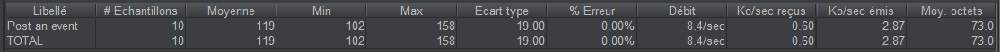
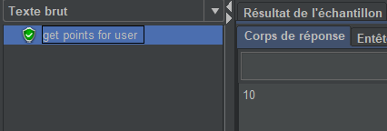
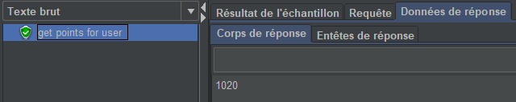
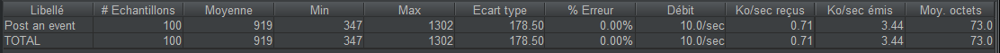

Pour les tests de charges et concurrence à l'aide de JMeter en suivant le séncario suivant:

J'envoie une règle.
Je récupère le nombre de points de l'utilisateur testé.

Je fais X nombres d'événements pour mon utilisateur.

Je récupère le nombre de points de l'utilisateur à la sortie des tests.

Dans le premier cas simple, j’ai testé avec 1 utilisateur qui fait 10 requêtes et j’ai obtenu 10 bons événements et un bon nombre de points. On remarque aussi le traitement de 8.4 requêtes par seconde.




Puis j’ai fait un test avec 1 utilisateur qui fait 1000 requêtes afin de voir la perte de performance du serveur.




On remarque une très grande diminution de la vitesse de traitement avec 1.4 req/s mais la cohérence des données est toujours présente avec plus de 1000 points accordés dans le pointScale voulu (1020).

Dans un deuxième temps, j’ai créé une nouvelle règle puis 10 utilisateurs qui font 10 événements.
Le résultat est le suivant :



Et le résultat en DB est le suivant:
```
[
  {
    "username": "test5",
    "appkey": 1,
    "pointScalesWithPoints": [
      {
        "pointScale": {
          "name": "test5",
          "description": "test5",
          "appKey": 1
        },
        "points": 11
      }
    ],
    "badgesArray": [
      {
        "name": "test5",
        "description": "test5",
        "appKey": 1
      }
    ]
  },
  {
    "username": "test5",
    "appkey": 1,
    "pointScalesWithPoints": [
      {
        "pointScale": {
          "name": "test5",
          "description": "test5",
          "appKey": 1
        },
        "points": 1
      }
    ],
    "badgesArray": [
      {
        "name": "test5",
        "description": "test5",
        "appKey": 1
      }
    ]
  },
  {
    "username": "test5",
    "appkey": 1,
    "pointScalesWithPoints": [
      {
        "pointScale": {
          "name": "test5",
          "description": "test5",
          "appKey": 1
        },
        "points": 1
      }
    ],
    "badgesArray": [
      {
        "name": "test5",
        "description": "test5",
        "appKey": 1
      }
    ]
  },
  {
    "username": "test5",
    "appkey": 1,
    "pointScalesWithPoints": [
      {
        "pointScale": {
          "name": "test5",
          "description": "test5",
          "appKey": 1
        },
        "points": 1
      }
    ],
    "badgesArray": [
      {
        "name": "test5",
        "description": "test5",
        "appKey": 1
      }
    ]
  },
  {
    "username": "test5",
    "appkey": 1,
    "pointScalesWithPoints": [
      {
        "pointScale": {
          "name": "test5",
          "description": "test5",
          "appKey": 1
        },
        "points": 1
      }
    ],
    "badgesArray": [
      {
        "name": "test5",
        "description": "test5",
        "appKey": 1
      }
    ]
  }
]
````

Nous constatons donc qu'il n'y a aucune gestion de la concurrence dans notre projet.
Nous avons pris le pari que l'utilisation du @Version corrigerait tous nos problèmes mais il c'est avéré que ce n'était pas le cas du tout.
Il faudrait donc passer à une approche plus pessimiste et utiliser des lock mais malheureusement nous n'avons pas le temps de faire cela.


